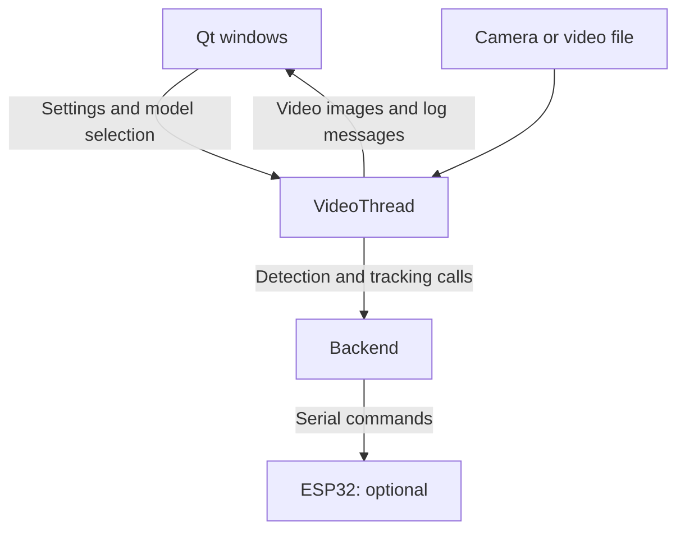

# Frontend: the user application

[Project overview](../README.md) · [Backend guide](../backend/README.md) · [Training guide](../training/README.md)

The frontend is Camman's **PyQt5 desktop application**. It displays a camera or
recorded game, lets the user choose a detector, and provides tracking controls
and connection status. Video appears inside the application window.

The frontend calls the backend as a Python library in the same process. It does
not start a separate backend server or run model training. Training produces the
`.pth` files that the application loads. A TUI/mpv interface is not implemented
in this version.

## How the parts connect



The worker opens the video source, loads detector/actor weights through the
backend, and processes frames. With inference enabled, the backend returns ball
boxes and draws them on the frame. With tracking also enabled, it can send pan
commands to the connected ESP32. Qt signals carry images and log messages back
to the window. Closing the app stops the worker and releases its video and serial
connections.

## Install

Start in the repository root, the directory containing `pyproject.toml`, rather
than inside `frontend/`. See the [project setup](../README.md#install) if you
still need to clone the repository or create a virtual environment.

Activate that environment. For NVIDIA acceleration, first install matching
PyTorch/torchvision packages using the
[PyTorch installation selector](https://pytorch.org/get-started/locally/).
Then install the desktop dependencies:

```sh
python -m pip install -e ".[frontend]"
python -m backend.tools.check_device
```

You need a graphical desktop and either a camera or a readable video file.
A model and ESP32 are optional for video preview. The training extras are not
required to run the desktop application.

## First run

Start with your default camera:

```sh
camman --source 0
```

Or use a recorded game and a detector produced by the training guide:

```sh
camman --source data/game_01/game.mp4 --model artifacts/detector_v1/trained_model_final.pth
```

`python -m frontend` accepts the same arguments as `camman`.
Relative paths are resolved from the directory where you launch the command.
Quote paths that contain spaces.

1. Confirm the video appears. The app initially starts in preview mode.
2. If you did not supply `--model`, open **Models**, upload a detector `.pth`,
   select it, and click **Load Selected Model**. Check the log for the load result.
3. Click **Start Inference** to show detected ball boxes.
4. To control a platform, launch with `--serial-port` and click **Start CamMan
   Agent** while inference is active. Without an actor model, this uses basic
   left/right/stop rules.

To run with a trained camera-control actor on Windows:

```sh
camman --source 0 --model artifacts/detector_v1/trained_model_final.pth --actor artifacts/policy_v1/actor_episode_best.pth --serial-port COM3
```

On Linux, substitute the actual serial port, such as `/dev/ttyUSB0`.
See the [backend hardware section](../backend/README.md#hardware-connections)
for protocol and firmware details.

## Startup options

| Option | Meaning | Default |
| --- | --- | --- |
| `--source` | Numeric camera index or video file path | Camera `0` |
| `--model` | Ball-detector checkpoint | First alphabetically sorted `.pth` in the model directory, if present |
| `--actor` | Optional camera-control actor checkpoint | Basic tracking rules |
| `--serial-port` | Explicit port, or `auto` to probe | No platform connection |
| `--device` | PyTorch device, such as `cpu` or `cuda:0` | CUDA if available, otherwise CPU |

Use `camman --help` to check the installed command's options. Source, actor,
device and serial port are selected at startup; restart the app to change them.
The Models window can change the detector while the video worker is running.

## Controls and model storage

| Control | What it does |
| --- | --- |
| **Start/Stop Inference** | Enables/disables ball detection; preview continues |
| **Start/Stop CamMan Agent** | Enables/disables automatic control while inference runs |
| **Manual Left / Manual Right** | Sends a command through the current serial connection |
| **Command Interval** | Sets the minimum interval between automatic commands: 0.1–2.0 seconds, initially 1.0 |
| **Models** | Copies detector weights into the model directory and requests a model load |
| **Platform** | Scans wired/Bluetooth availability; it does not replace the active serial connection |

The model directory is `~/.camman/models`, or
`%USERPROFILE%\.camman\models` on Windows. Override it before launching:

```powershell
# Windows PowerShell
$env:CAMMAN_MODELS_DIR = "C:\Camman\models"
camman --source 0
```

```bash
# Linux/macOS
export CAMMAN_MODELS_DIR="$HOME/camman-models"
camman --source 0
```

Keep only **detector** checkpoints in this directory. Actor and critic files
also use `.pth`, but cannot be loaded as detectors. Use `--actor` for actor
weights; critic weights are for training. An explicit `--model` takes priority
over directory selection. Selecting a model in the window does not persist that
selection as the next startup default.

## Where to change the code

| File | Responsibility |
| --- | --- |
| [app.py](app.py) | CLI arguments, Qt application startup and main window |
| [ui/main_screen.py](ui/main_screen.py) | Main window, buttons, video display and signal connections |
| [ui/model_menu.py](ui/model_menu.py) | Model upload and selection |
| [platform_screen.py](platform_screen.py) | Connection status and scan workers |
| [threads/video_threads.py](threads/video_threads.py) | Model-loading requests, worker state and resource ownership |
| [video.py](video.py) | Frame loop, calls into the backend, playback pacing and presentation |

Keep detection, model architecture and device protocols in `backend/`; keep
training algorithms and dataset preparation in `training/`.

## Troubleshooting and tests

| Symptom | Check |
| --- | --- |
| `camman` is not found | Activate the environment and reinstall `.[frontend]`; try `python -m frontend --help` |
| Qt/PyQt5 import error | Install `.[frontend]` into the Python environment being used |
| Video does not open | Confirm the path or camera index and that another application is not holding the camera |
| Video ends but the window stays open | Playback stops at end of file; restart the app to replay it |
| Preview works, but no boxes appear | Load a detector, enable inference, and check the log; the current default confidence threshold is 0.98 |
| Model load fails | Use a compatible Camman detector checkpoint; a failed replacement keeps the previous model |
| Tracking does not move the platform | Check `--serial-port`, enable both inference and tracking, and verify firmware compatibility |

Install development dependencies and run the frontend checks from the root:

```sh
python -m pip install -e ".[frontend,training,dev]"
python -m pytest frontend/tests
```

For headless Linux **tests**, set `QT_QPA_PLATFORM=offscreen`. Run the actual
desktop application in a graphical session. Tests use mocked devices rather
than a real camera platform.
