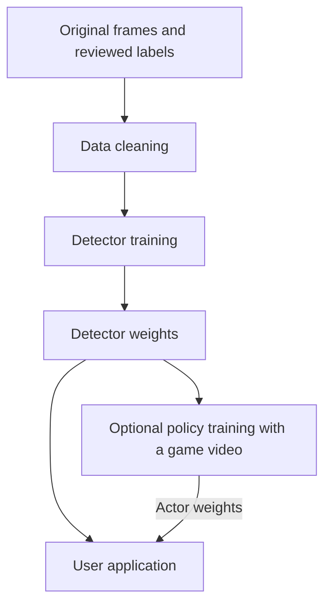

# Training: build models and prepare data

[Project overview](../README.md) · [Frontend guide](../frontend/README.md) · [Backend guide](../backend/README.md)

This component prepares labeled images and trains the models consumed by the
user application. Run training on your GPU server; copy the resulting model
weights to the application machine. Training does not need to run on the Pi or
other deployment device.

There are **two different training jobs**:

| Model | Learns to | Required inputs | Used by the application as |
| --- | --- | --- | --- |
| Ball detector | Find the ball's bounding box in an image | Original images and reviewed box labels | `--model detector.pth` |
| Optional camera-control actor | Choose normalized pan velocity from ball position, motion and history | Cached trajectories from reviewed fixed-camera footage | `--actor actor.pth` |

Train the **detector first**. The application can detect balls and use basic
proportional pan tracking without an actor. Actor training does not improve the
ball detector; it learns a separate camera-control policy.

## How the parts connect



Both training jobs reuse definitions in `backend/` so their saved weights match
what the application loads. Training has no dependency on the frontend. The
frontend does not call the training loop; transferring a `.pth` file connects
training to deployment.

## 1. Set up the training environment

Use a checkout of `dev` and run all commands from the **repository root**, the
directory containing `pyproject.toml`. Clone instructions are in the
[project README](../README.md#install). Python 3.12 is the version used for the
repository's CPU tests; the package declares Python 3.10 or newer.

Create and activate an environment if you do not already have one:

```powershell
# Windows PowerShell
python -m venv .venv
.venv\Scripts\Activate.ps1
```

```bash
# Linux
python3 -m venv .venv
source .venv/bin/activate
```

For the RTX 5070 Ti server, use the
[official PyTorch installation selector](https://pytorch.org/get-started/locally/)
to install a matching CUDA-enabled `torch` and `torchvision` pair for your OS and
NVIDIA driver. Run its install command inside the active environment, then:

```sh
python -m pip install -e ".[training]"
python -m backend.tools.check_device
```

Check that the diagnostic reports `CUDA available: True`. You can also check
that this environment can actually create a GPU tensor:

```sh
python -c "import torch; print(torch.ones(1, device='cuda:0'))"
```

If this fails, resolve the driver/PyTorch installation before starting a long
GPU run. `--device cpu` is available for a small functional check. The examples
below use `cuda:0` for the server; they are not hardware performance guarantees.

Detector and policy training run without a graphical display. Frame extraction
requires `ffmpeg` on PATH (`ffmpeg -version` should work). The optional manual
review tool needs a graphical desktop and Python's Tk support, which can be
checked with `python -m tkinter`.

## 2. Prepare the images

For this walkthrough, put a game at `data/game_01/game.mp4`. Use your own paths
if preferred; quote any path containing spaces. Local `data/` and generated
`artifacts/` directories are ignored by Git.

Extract frames into a new directory:

```sh
python -m training.data.video extract data/game_01/game.mp4 data/game_01/frames
```

The tool writes `frame_00000.jpg`, `frame_00001.jpg`, and so on, starting at zero.
It asks FFmpeg not to overwrite existing files. There is an optional `--fps`
argument for resampling; omitting it requests extraction without an explicit
FPS filter. If you change extraction FPS, create labels matching that extracted
sequence. Check frame numbering against video-annotation exports before
training, especially if an export starts counting at one.

Train on the **original frames**, not images with boxes drawn on them.
The `inferred_...` preview images generated later are only for human review.

## 3. Create or import labels

Each image needs reviewed ball bounding boxes. You can label images using your
annotation tool and convert them into the format below, or use the supported
Label Studio **video-sequence** exports. For a first model, provide manual labels;
the automatic annotation tool requires an existing trained detector.

Save the labels as `data/game_01/labels.json`. This is an illustrative example;
replace the coordinates with real boxes from your images:

```json
[
  {"frame": "frame_00000.jpg", "boxes": [[100, 50, 120, 70]]},
  {"frame": "frame_00001.jpg", "boxes": []}
]
```

Each box is `[x_min, y_min, x_max, y_max]` in **original-image pixels**:
`x` increases to the right and `y` increases downward. Each box must have
positive width and height. All boxes are treated as the single `Ball` class.
One frame can contain multiple boxes. An empty list means you have explicitly
confirmed that there is no ball to label in that image; an unreviewed frame or
failed prediction is not automatically a trustworthy negative example.

The cleaner accepts these existing formats:

| Input format | Supported structure |
| --- | --- |
| Clean records | `frame` filename plus `boxes`, as above |
| Old flat records | `frame`, `x_min`, `y_min`, `x_max`, `y_max` |
| Inference/reviewer output | A list of dictionaries mapping image filenames to box dictionaries |
| Label Studio video exports | `box` sequences or `annotations/result/value/sequence` with percentage coordinates |

Arbitrary COCO/YOLO exports and Label Studio image-project exports are not
converted by this command. Video sequences contribute their explicit enabled
entries; the cleaner does not interpolate boxes into missing frames. Disabled
annotations are skipped, and missing annotations are not assumed negative.

For the first run, keep each video's labels with its own frame directory.
Files whose `videos` metadata identifies multiple sources are rejected to avoid
merging identical frame names from different games. To assemble a multi-video
training set, use unique relative paths such as `game_01/frame_00000.jpg` and
`game_02/frame_00000.jpg`, with one common `--images` root and canonical records.
The tools do not automatically reorganize or rename those images for you.

## 4. Clean and check the dataset

```sh
camman-clean --annotations data/game_01/labels.json --images data/game_01/frames --output data/game_01/clean.json
```

The cleaner opens the referenced images, groups boxes by image, removes repeated
identical boxes, preserves explicitly empty targets, and clips boxes to image
bounds. Missing images, invalid/non-finite boxes and empty annotation sets are
reported as errors. Inspect the output and spot-check box placement on the
original frames before training. A file passing these checks can still contain
incorrect human labels.

The training command also invokes this cleaner, so it can accept the supported
raw formats directly. Saving `clean.json` first makes it easier to inspect
exactly what will be used. Every record supplied to the trainer is used for
training; there is no automatic train/validation split.

## 5. Run a small detector training trial

Start with a short, reviewed subset and one epoch to check image loading, GPU
execution and output paths:

```sh
camman-train --annotations data/game_01/clean.json --images data/game_01/frames --epochs 1 --batch-size 1 --workers 0 --device cuda:0 --output artifacts/detector_smoke
```

An **epoch** is one pass through the supplied training images. `--batch-size`
controls how many images are processed together, and `--workers` controls the
background data-loader processes. A one-epoch run checks the pipeline; it does
not establish that the detector is accurate.

The default uses COCO pretrained weights as a starting point and may download
them on the first run. `--no-pretrained` disables that download and starts with
random weights; it does not resume a previous detector.

## 6. Train the detector

Once the trial works, start a separate run:

```sh
camman-train --annotations data/game_01/clean.json --images data/game_01/frames --epochs 42 --batch-size 2 --workers 4 --device cuda:0 --output artifacts/detector_v1
```

The example starts with a batch size of two. Adjust it for the memory available
on your server. Use a new output directory for each experiment: rerunning into
the same directory can replace previous checkpoints.

| Option | Meaning | Code default |
| --- | --- | --- |
| `--annotations` | Supported annotation JSON | Required |
| `--images` | Root used to resolve each record's image path | Required |
| `--epochs` | Passes through the training data | `42` |
| `--batch-size` | Images per batch | `8` |
| `--workers` | Data-loader worker processes | `4` |
| `--device` | `cuda:0`, `cpu`, or another PyTorch device | CUDA if available, otherwise CPU |
| `--output` | Checkpoint/output directory | `artifacts/detection` |
| `--no-pretrained` | Start without COCO initialization | Off |

`python -m training.detection.train` accepts the same arguments as `camman-train`.
Use `camman-train --help` to inspect the installed command.

The current loop resizes images to 640×640, augments them with horizontal flips
and brightness/contrast changes, and trains Faster R-CNN with a ResNet-50/FPN
backbone. Boxes stay in pixel coordinates through the augmentation pipeline.
The optimizer is Adam at an initial learning rate of `0.0001`, with five warmup
epochs followed by a step scheduler. These settings live in
[detection/train.py](detection/train.py); they are not additional CLI options.

Progress is printed as epoch number, average **training loss** and learning
rate. The script does not compute validation precision/recall or mAP, select a
best detector by validation score, or provide a `--resume` option. Lower training
loss alone does not demonstrate better performance on another game. Keep games
outside the training set for later evaluation; that evaluation is currently a
separate task rather than a built-in command.

## 7. Find the model and use it in the application

For the 42-epoch example, the output directory contains:

| Output | Contents / use |
| --- | --- |
| `checkpoint_epoch_10.pth`, `20`, `30`, `40`, and `42` | Model, optimizer and scheduler state, epoch and loss; saved every ten epochs and on the final epoch |
| `trained_model_final.pth` | Final detector state dictionary; the simplest file to copy to the application |

All numbered checkpoints use the full `checkpoint_epoch_N.pth` naming pattern.
The backend can load either format for **inference**. Saved optimizer/scheduler
state does not mean the trainer currently implements resume. No trained model
is bundled with the repository.

Copy `trained_model_final.pth` to the machine running Camman. In that machine's
application environment, supply its actual local path:

```sh
camman --source data/game_01/game.mp4 --model artifacts/detector_v1/trained_model_final.pth
```

The example assumes those files are present at the shown paths. If previewing
on the training server itself, install `.[frontend]` and use a graphical session.
Click **Start Inference** to display predictions. Alternatively, upload the
checkpoint using the frontend's **Models** window. See the
[frontend guide](../frontend/README.md) for storage locations and controls.

The current deployment loader is PyTorch/Faster R-CNN. This pipeline does not
yet produce NCNN models or establish real-time performance on a Raspberry Pi 5.
The existing 640px resize and external ImageNet normalization are preserved for
checkpoint compatibility even though Faster R-CNN also normalizes internally.
Changing that convention requires coordinated preprocessing changes and
retraining, as described in the [backend guide](../backend/README.md).

## Optional: generate and review more annotations

After you have a detector, use it to propose labels for another image directory:

```sh
camman-annotate --images data/game_02/frames --model artifacts/detector_v1/trained_model_final.pth --output artifacts/review/candidates.json --preview-dir artifacts/review/images --confidence 0.98 --device cuda:0
```

The command loads the detector once and writes a candidate record for every
image, including those with no predictions. `--preview-dir` is optional; when
provided, it writes images named `inferred_<original filename>` with overlays.

On a desktop with Tk available, review those candidates:

```sh
python -m training.data.review --annotations artifacts/review/candidates.json --images artifacts/review/images --output artifacts/review/edited --batch-size 100
```

The reviewer lets you keep/reject a single candidate, select a numbered
candidate when there are several, or keep all. It offers saves periodically
and at the end, writing `jdata_<first-frame>_<last-frame>.json` under the output
directory. Use the filename it prints as `camman-clean --annotations`, and use
`data/game_02/frames` as `--images` so training sees the original images.

This reviewer selects/rejects existing boxes; it cannot draw missing boxes or
repair coordinates. It automatically skips frames with no predictions. Check
missed balls in an annotation editor before treating those frames as negative
training data. If review is stopped early, the saved file covers only entries
processed so far; do not assume its filename proves the whole sequence was
reviewed. Progress saves can overwrite the same file within a review session.

Other offline tools:

| Task | Command |
| --- | --- |
| Assemble sorted images into an MP4 | `python -m training.data.video assemble artifacts/review/images artifacts/review/preview.mp4 --fps 30` |
| Concatenate two annotation lists | `python -m training.data.combine first.json second.json combined.json` |
| Add legacy video-source metadata to a copy | `python -m training.data.metadata --annotations labels.json --video game_01 --images data/game_01/frames --output labels_with_source.json` |

Concatenation preserves entries and metadata; it does not resolve frame-name
collisions or create a train/validation split. Historical annotations in
[data/examples/legacy/](data/examples/legacy/) are retained for reference and
contain old paths; they are not a complete ready-to-train dataset.

## Optional: train the camera-control policy

The actor–critic pipeline trains **pan control**, separately from ball detection.
Training runs on your RTX server (or CPU); deployment loads only the small actor
on the Jetson and sends normalized velocity commands to the microcontroller.
No camera controller is opened during training.

The workflow is: **cache trajectories → train DDPG → evaluate on other games →
dry-run → calibrate and deploy**. The detector is run once per source video,
not inside every reinforcement-learning episode.

### 1. Cache representative trajectories

Use fixed, wide-view footage where the ball can move within a virtual camera
viewport. A video from an already panning camera confounds ball and camera
motion; stabilize it or use fixed-camera recordings before building this cache.
Choose different games for training, validation and final testing. Include fast
plays, edge-of-view targets, false detections, occlusions and lighting changes.

```sh
camman-cache-tracks --video data/game_01/game.mp4 --model artifacts/detector_v1/trained_model_final.pth --device cuda:0 --confidence 0.98 --output data/tracks/game_01.npz
camman-cache-tracks --video data/game_02/game.mp4 --model artifacts/detector_v1/trained_model_final.pth --device cuda:0 --confidence 0.98 --output data/tracks/game_02.npz
```

Set `--fps 30` if the video has missing/incorrect FPS metadata; use its actual
rate. `--max-frames` limits extraction for a trial. Runtime options such as
`--detector-size 640 --precision fp16` allow caching with the intended deployment
settings. Verify small-ball detection quality when changing these settings.

A cache is a compact, versioned NumPy archive containing normalized `[x, y]`
centers, a per-frame detection mask, FPS and source metadata. No video images or
pickle objects are required by the RL loop. Failed/missing detections are
masked, not silently converted into a centered ball. Detector-generated
trajectories are **not ground truth**: review representative frames and correct
bad tracks before using evaluation numbers to select a real deployment.
For manually reviewed trajectories, construct and save a `TrackSequence` from
`training.reinforcement.tracks` with the same normalized coordinates and mask.

### 2. Train with matching camera calibration

```sh
camman-train-agent --tracks data/tracks/game_01.npz --validation-tracks data/tracks/game_02.npz --episodes 200 --steps 1000 --device cuda:0 --control-hz 10 --camera-hfov-deg 90 --max-pan-speed-deg-s 30 --view-fraction 0.5 --output artifacts/policy_v1
```

Both `--tracks` and `--validation-tracks` accept multiple files. The example FOV
and speed are placeholders: measure your camera's horizontal FOV and maximum
pan speed, and set the firmware to the same speed. `--view-fraction` is the
fraction of the full source frame visible through the virtual camera. This is
a simplified local image-motion model, not an exact camera/lens calibration.
Tilt is manually fixed; this actor controls one pan axis.

| Option | Default | Purpose |
| --- | --- | --- |
| `--episodes` | 200 | Total target episode count, also when resuming |
| `--steps` | 5000 | Maximum decision steps per episode; EOF also truncates |
| `--batch-size`, `--memory-size` | 128 / 50000 | Optimization batch and bounded CPU replay capacity |
| `--warmup-steps` | 1000 | Initial random-action collection; optimization also requires a full batch |
| `--lr-actor`, `--lr-critic` | 0.0001 / 0.001 | Separate learning rates |
| `--gamma`, `--tau`, `--grad-clip` | 0.99 / 0.005 / 1 | Discount, target interpolation and gradient bound |
| `--noise-sigma`, `--noise-decay`, `--noise-min` | 0.2 / 0.995 / 0.02 | Gaussian exploration; decay each episode |
| `--eval-every`, `--checkpoint-every` | 10 / 10 | Validation and full resumable checkpoint intervals |
| `--control-hz` | 10 | Intended policy decisions/s; also saved for deployment |
| `--camera-hfov-deg`, `--max-pan-speed-deg-s` | 90 / 30 | Shared physical action calibration |
| `--lost-target-timeout-s`, `--max-frame-age-s` | 0.5 / 0.5 | Target-loss and frame-freshness limits |
| `--deadband` | 0.02 | Ignore tiny normalized commands |
| `--view-fraction`, `--motor-response-s` | 0.5 / 0.08 | Virtual crop width and approximate motor response |
| `--dropout`, `--randomization` | 0.05 / 0.2 | Training-only sensor dropout, motor-gain variation and timing jitter |
| `--seed` | 0 | Training initialization and sampling seed |
| `--cpu-threads` | Torch default | Useful for the small network, including CPU trials |

DDPG uses a seven-value observation shared with the backend, bounded velocity
actions, a numeric replay ring, detached target-network estimates, gradient
clipping and soft target updates. The actor is optimized through the critic's
action input while critic parameters are frozen. Truncations retain Bellman
bootstrapping. The replay stores the command actually executed after the
shared loss/deadband guard. See the [observation contract](../backend/README.md#tracking-and-actor-inference).

Episodes start at randomized observable positions and camera offsets. Camera
motion changes the viewport, and the actor cannot see the target outside that
viewport. Reward favors horizontal centering, keeping the ball visible and
smooth/low-effort movement; it does not penalize vertical error that pan cannot
correct. Motor response, randomization and dropout approximate deployment
conditions, but do not replace measured latency, backlash, acceleration and
travel-limit testing. The policy cannot recover a ball that remains outside
view after the loss timeout; it stops until a usable detection returns.

Without `--validation-tracks`, each source is split into contiguous 80% training
and 20% validation sections. This avoids exact frame reuse but correlated parts
of the same game can still overstate generalization; separate games are better.
Exact duplicate train/validation caches are rejected. Validation uses three
initial offsets without exploration noise or synthetic dropout. Each rollout
starts at the first usable frame and runs up to `--steps`; split long recordings
into representative clips or raise that limit to evaluate more of each game.
Model selection uses mean held-out reward, not training score.

The older `--video ... --model ...` invocation remains a convenience: it caches
the video once under the run directory, then follows this same training path.
For several runs, cache explicitly to reuse detections.

### 3. Inspect outputs and resume

| Artifact | Contents / use |
| --- | --- |
| `actor_episode_best.pth` | Best validation actor, schema, calibration, validation metrics and provenance; deploy this after evaluation |
| `actor_episode_final.pth` | Last actor; it may be worse than the best actor |
| `critic_episode_best.pth`, `critic_episode_final.pth` | Critic weights for analysis; never sent to the application |
| `training_latest.pth` | Full actor/critic/target weights, optimizers, replay, RNGs, progress, configuration and data fingerprints |
| `run.json` | Settings, source metadata, split description and baseline results |
| `metrics.jsonl` | Episode rewards, loss values, update counts and periodic validation |
| `summary.json` | Best score and whether it exceeds the proportional-control baseline |

A run with no optimizer updates fails clearly and exports **no deployable
actor**, while leaving its full checkpoint available for continuation. An actor
is not labeled successful merely because training completed. Compare visibility,
centering, mean error and action changes against the stationary and proportional
baselines in the reports. A learned actor can underperform the simpler controller.

```sh
camman-train-agent --resume artifacts/policy_v1/training_latest.pth --episodes 400 --device cuda:0 --output artifacts/policy_v1
```

`--episodes 400` means 400 total episodes. Omitted settings, reward weights and cache paths are
restored. Omit `--output` to reuse the checkpoint directory. Resume validates configuration and actual trajectory fingerprints;
changing them requires a new run. Paths can be supplied again if caches moved
but their content is identical. Save/resume occurs at episode boundaries, not
mid-step. CPU resume is tested against uninterrupted training; identical GPU
results also depend on the PyTorch/CUDA stack and deterministic kernels.

### 4. Evaluate, then deploy the actor

Cache a third, untouched game using step 1, then evaluate it:

```sh
camman-evaluate-agent --actor artifacts/policy_v1/actor_episode_best.pth --tracks data/tracks/game_03.npz --steps 5000 --output artifacts/policy_v1/test-game.json
camman-track --source data/game_03/game.mp4 --model artifacts/detector_v1/trained_model_final.pth --actor artifacts/policy_v1/actor_episode_best.pth --frames 300
```

Evaluation runs the closed-loop virtual-camera simulation. The headless dry-run
checks live processing/command production but cannot prove physical closed-loop
performance: a recorded view does not respond to the commands. Inspect footage,
latency and false target switches as well as numeric scores before motor tests.

Configure/build the [CAMMAN/1 velocity firmware](../backend/firmware/controller/README.md),
check direction and measured calibration with a short manual pulse, then deploy:

```sh
camman --source 0 --model artifacts/detector_v1/trained_model_final.pth --actor artifacts/policy_v1/actor_episode_best.pth --serial-port COM3
```

Enable both **Start Inference** and **Start CamMan Agent**. On a headless Jetson,
use `camman-track --profile jetson --device cuda` with the same model/actor flags
and `--serial-port /dev/ttyUSB0`; it starts tracking immediately. `--invert-pan`
handles reversed motor wiring. Only the actor and detector are needed there.
The default actor has approximately 36,000 parameters; the detector remains the
main compute cost.

**Migration:** old bare actor weights are incompatible with the new seven-value
state and velocity semantics and must be retrained. Old `P:` position firmware
must be replaced by CAMMAN/1-compatible velocity firmware. Detector weights
retain their existing compatibility. The application rejects incompatible
actors/controllers instead of guessing their scale.

### Software-only trial without a detector or controller

This exercises real optimizer updates and export on synthetic trajectories. It
is useful for checking installation; it does not produce a game-ready model.

```sh
camman-cache-tracks --synthetic --max-frames 1800 --seed 0 --output data/tracks/demo_train.npz
camman-cache-tracks --synthetic --max-frames 900 --seed 91 --output data/tracks/demo_validation.npz
camman-train-agent --tracks data/tracks/demo_train.npz --validation-tracks data/tracks/demo_validation.npz --episodes 30 --steps 100 --batch-size 32 --memory-size 5000 --warmup-steps 128 --eval-every 5 --checkpoint-every 5 --device cpu --cpu-threads 1 --output artifacts/policy_demo
camman-evaluate-agent --actor artifacts/policy_demo/actor_episode_best.pth --tracks data/tracks/demo_validation.npz --steps 100
```

All installed commands have module equivalents: `python -m
training.reinforcement.tracks`, `.train`, and `.evaluate` (use the complete module
name for each). The DDPG implementation follows the
[algorithm and target-update equations](https://spinningup.openai.com/en/latest/algorithms/ddpg.html).

## Code map

| Location | Responsibility |
| --- | --- |
| [detection/train.py](detection/train.py) | Detector CLI, augmentation, optimizer, training loop and checkpoints |
| [data/clean.py](data/clean.py) | Annotation parsing, coordinate conversion and validation |
| [data/dataset.py](data/dataset.py) | Image/target loading, including multiple boxes and negative images |
| [data/auto_annotate.py](data/auto_annotate.py), [data/review.py](data/review.py) | Candidate generation and desktop selection/rejection |
| [data/video.py](data/video.py) | Frame extraction and video assembly |
| [data/combine.py](data/combine.py), [data/metadata.py](data/metadata.py) | Annotation list and source-metadata utilities |
| [reinforcement/train.py](reinforcement/train.py), [reinforcement/agent.py](reinforcement/agent.py) | Policy-training CLI and DDPG learning |
| [reinforcement/tracks.py](reinforcement/tracks.py) | One-pass video detection caches and synthetic trials |
| [reinforcement/environment.py](reinforcement/environment.py) | Calibrated virtual viewport, visibility, shared state and motor response |
| [reinforcement/evaluate.py](reinforcement/evaluate.py) | Deterministic validation and controller baselines |
| [tests/](tests/) | Data handling, training outputs, environment and agent checks |

## Troubleshooting and tests

| Problem | Next check |
| --- | --- |
| Training command is missing | Activate the environment, install `.[training]`, or use the `python -m ...` equivalent |
| CUDA unavailable / GPU architecture error | Verify the active environment, compatible NVIDIA driver and current matching PyTorch/torchvision installation |
| GPU out of memory | Retry with `--batch-size 1`; close other GPU workloads |
| Worker error or apparent data-loading hang | Retry with `--workers 0` to see image/annotation errors in the main process |
| Image not found | Match record filenames, `--images`, frame numbering and the extraction directory |
| Invalid boxes or no annotations | Check JSON structure, finite pixel coordinates, box width/height, and whether video entries are disabled |
| Pretrained weights cannot download | Make the weights available through PyTorch's cache or use `--no-pretrained` for a deliberate run from random initialization |
| Reviewer cannot open a window | Run it in a graphical session with Tk; server training itself does not need a display |
| Low loss but poor game detection | Inspect labels and unseen-game predictions; the trainer currently reports training loss only |

For tests, install the full development environment (including Qt for the test
plugin), then run from the repository root:

```sh
python -m pip install -e ".[frontend,training,dev]"
python -m pytest training/tests
```

Tests include real CPU actor/critic updates, deterministic resume, held-out
selection, actor deployment and simulated control. Detector/video dependencies
are mocked where needed. This verifies code and checkpoint compatibility, not
real-game accuracy, GPU performance or physical motor behavior.
